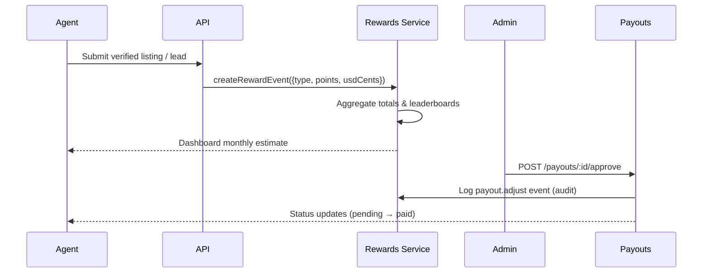
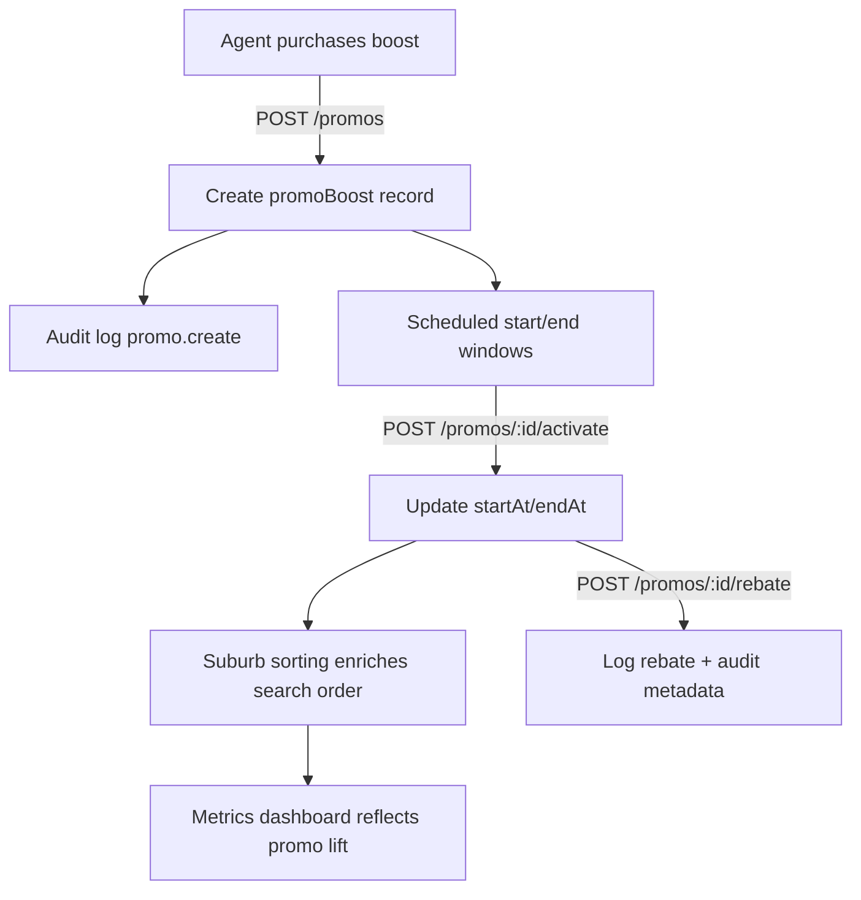
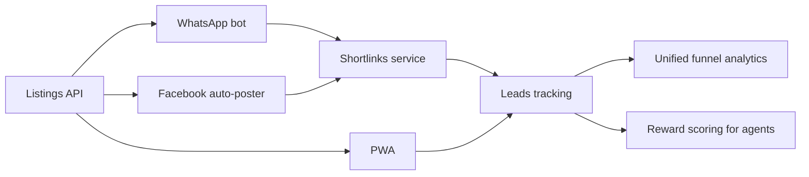
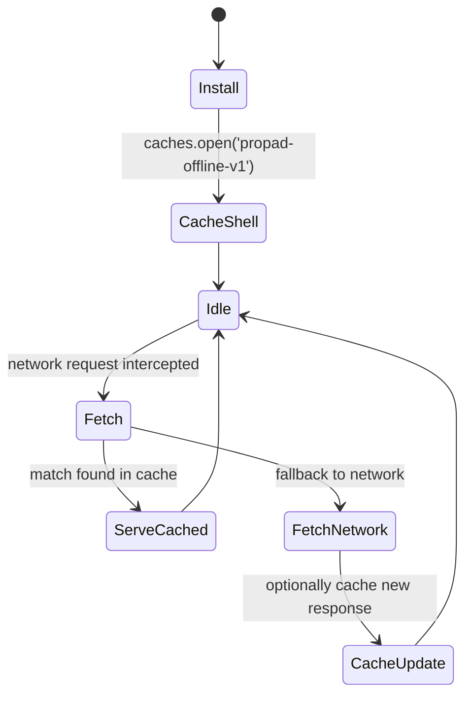

# Architecture

PropAd is implemented as a TypeScript monorepo with clearly delineated boundaries between the web PWA, API, shared packages, and infrastructure. The solution is optimised for offline-friendly access, verifiable listings, and zero-fee monetisation.

## High level overview

- **Next.js 14 PWA (`apps/web`)** – App Router, Tailwind, shadcn-inspired UI primitives, React Query for data fetching, NextAuth (email OTP + Google), and a service worker for offline caching.
- **NestJS API (`apps/api`)** – REST API with JWT-based auth, RBAC guards, Prisma ORM, BullMQ queue integration, and Pino structured logging.
- **Shared packages** – `@propad/ui`, `@propad/config`, and `@propad/sdk` provide design system primitives, runtime configuration, and a typed API client.
- **Data layer** – PostgreSQL via Prisma, Redis for caching/queues, MinIO (S3-compatible) for asset storage.
- **Infrastructure** – Docker Compose orchestrates the stack for local development with reproducible environments.

## Backend architecture

The NestJS API exposes modular domains:

- **Auth** – JWT issuance for API access, RBAC decorators and guards, NextAuth compatibility for the web app, and support for OTP (email magic links handled by NextAuth).
- **Listings & verifications** – Prisma models ensure every listing is associated with an owner and a verification entry. The metrics service surfaces dashboard KPIs.
- **Queues** – BullMQ is preconfigured for background jobs like media processing and verification workflows.
- **Logging/Monitoring** – Pino HTTP logs include a request ID, and `/health` provides a health check endpoint for orchestration.
- **Conversations** – A dedicated module orchestrates lead-to-agent chats, exposing REST endpoints and a WebSocket gateway layered on top of NestJS `@WebSocketGateway`. The gateway runs behind a Pusher-compatible adapter so the web app can reuse existing client tooling.

## Frontend architecture

The PWA uses the App Router with nested layouts for marketing pages, authentication, and role-restricted dashboards. React Query coordinates server state and caching, while shadcn-style components from `@propad/ui` ensure consistency. A service worker caches the shell for offline resilience.

Forms rely on `react-hook-form` + `zod` for type-safe validation. RBAC is enforced client-side using helper utilities from `@propad/ui` and server-side through NextAuth session roles.

## Shared packages

- `@propad/ui` – Tailwind-powered components, toast notifications, and styling utilities.
- `@propad/config` – Runtime-safe environment handling for both Next.js and NestJS.
- `@propad/sdk` – Ky-powered REST client with Zod validation for typed usage across apps.
- `@propad/realtime` (planned) – Shared helpers for subscribing to conversation channels, normalising typing/delivery events, and reconciling optimistic updates in the web app.

## Data model

Prisma models encode key domain entities: `User`, `Listing`, `Verification`, `RewardPool`, `AuditLog`, and the messaging tables required for dispute-ready audit trails. The conversation suite comprises:

- `Conversation` – stores the subject, linked property/agency/landlord IDs (when applicable), creator, status (`OPEN`, `RESOLVED`, `ARCHIVED`), and timestamps.
- `ConversationParticipant` – links users to conversations with role metadata (`BUYER`, `TENANT`, `AGENT`, `LANDLORD`, `VERIFIER`, `ADMIN`), join time, and mute state.
- `Message` – captures sender, body, attachment payload (JSON manifest of stored S3 keys), and edit/delivery timestamps.
- `MessageFlag` – records moderation events (spam, abuse, scam, contact-info breaches) and ties them back to reporting users for escalation.

Attachment processing leverages the existing MinIO pipeline for storage while a media worker strips EXIF metadata, produces thumbnails, and invokes ClamAV scans before finalising uploads. Conversation status transitions feed into audit logs for dispute resolution.

## System diagrams

### Listing verification flow

```mermaid
flowchart LR
  A[Agent/Landlord drafts listing in PWA] --> B[Submit for verification]
  B -->|POST /properties/:id/submit| C[Property status = PENDING_VERIFY]
  C --> D[Verifier queue (GET /verifications/queue)]
  D -->|Approve| E[Create Verification PASS]
  D -->|Reject| F[Create Verification FAIL]
  E --> G[Property marked VERIFIED + verifiedAt timestamp]
  F --> H[Property archived & strike review]
  E & F --> I[Audit log entry (verification.*)]
  G --> J[Listing promoted to public feed/search]
```

### Rewards lifecycle



### Promo boost workflow



### Meta funnels



### PWA caching strategy



## Future enhancements

- Implement Prometheus metrics exporter for API performance insights.
- Extend BullMQ queues for verification notifications and reward disbursements.
- Add Playwright journeys covering listing creation, verification, and reward payout flows.
