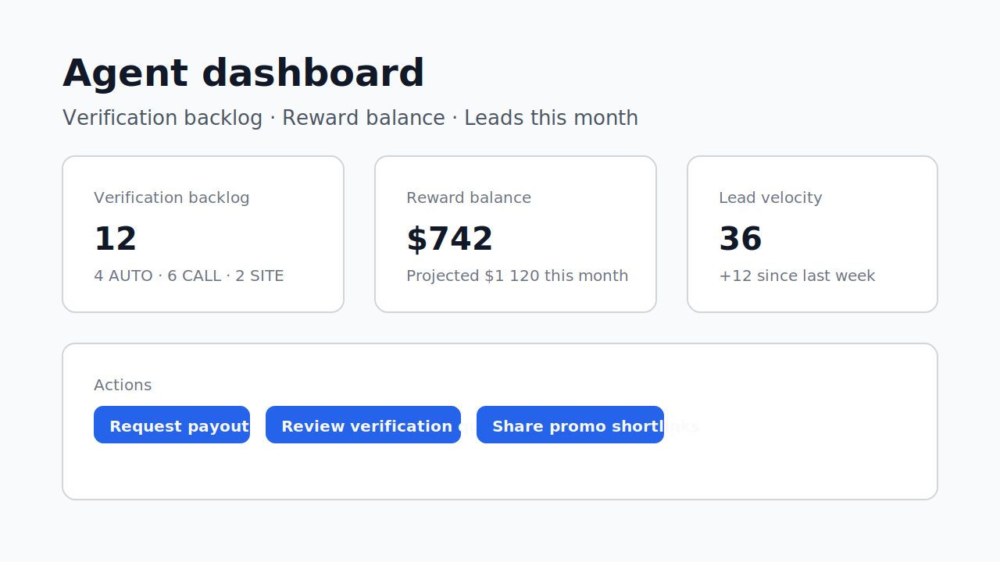
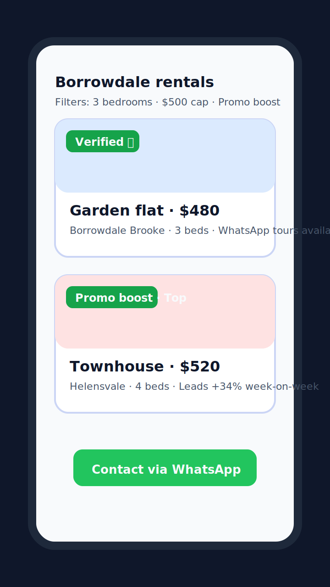
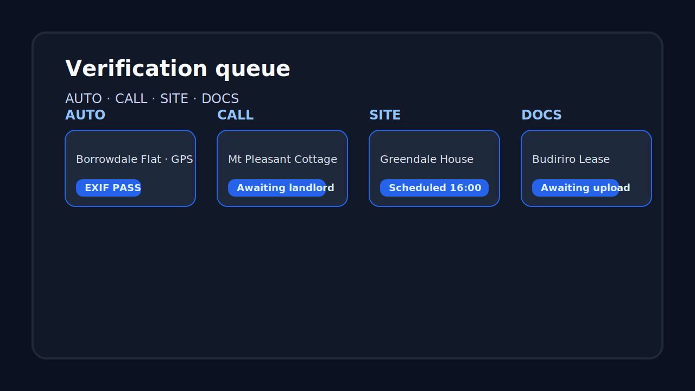

# PropAd Knowledge Base

PropAd is a fee-free property marketplace for Southern Africa that combines rigorous listing verification with community-driven rewards. This documentation hub gives new contributors, operators, and stakeholders a high-level orientation to the product, platform features, and visual experience.

## Overview

PropAd enables agents and landlords to publish listings that renters can trust. Verification specialists review every submission before it goes live, WhatsApp and Facebook automations broadcast inventory to where tenants already browse, and an agent rewards pool redistributes promotional spend back to high-performing partners. The stack is built as a TypeScript monorepo (Next.js PWA + NestJS API) orchestrated through Docker for reproducible environments.

## Key Features

- **Trustworthy listings** – Structured verification workflow, GPS/exif evidence capture, and policy strike tracking keep the marketplace fee-free and scam resistant.
- **Multi-channel discovery** – Responsive web app with offline caching, WhatsApp concierge bot, shortlinks, and Facebook auto-posting extend reach beyond the core PWA.
- **Agent incentives** – Configurable reward events, promo revenue sharing, and payout tooling motivate quality supply while remaining transparent to operators.
- **Operational dashboards** – Built-in analytics for verifiers, admins, and agents surface backlog, funnel, and payout metrics without external BI dependencies.
- **Extensible infrastructure** – Shared packages for UI, config, and SDK usage; queue-backed background jobs; MinIO-backed media storage; and Prisma migrations for the data model.

## Experience highlights

- **Agent dashboard overview** – Surfacing verification backlog, reward balance, lead velocity, and payout CTA in a single glance. 
- **Mobile-friendly listing cards** – Verified badges, promo boost tags, and WhatsApp contact buttons optimised for low-bandwidth users. 
- **Verification queue** – Status-driven workflow for AUTO, CALL, SITE, and DOCS review methods with evidence attachments. 

## Additional Resources

- [Setup Guide](./SETUP.md) – One-command bootstrap, migrations, seeding, and demo credentials.
- [Architecture Deep Dive](./ARCHITECTURE.md) – Platform layout, data flows, and system diagrams.
- [API Reference](./API.md) – Endpoints, payload contracts, and sample responses.
- [Security Controls](./SECURITY.md) – RBAC matrix, rate limiting, banned phrase policies, and audit coverage.
- [Product Specification](./PRODUCT_SPEC.md) – Detailed requirements, personas, and roadmap context.
- [Release Validation Checklist](./QA_VALIDATION.md) – Manual QA scenarios covering ads, discovery, agencies, property, and messaging.
